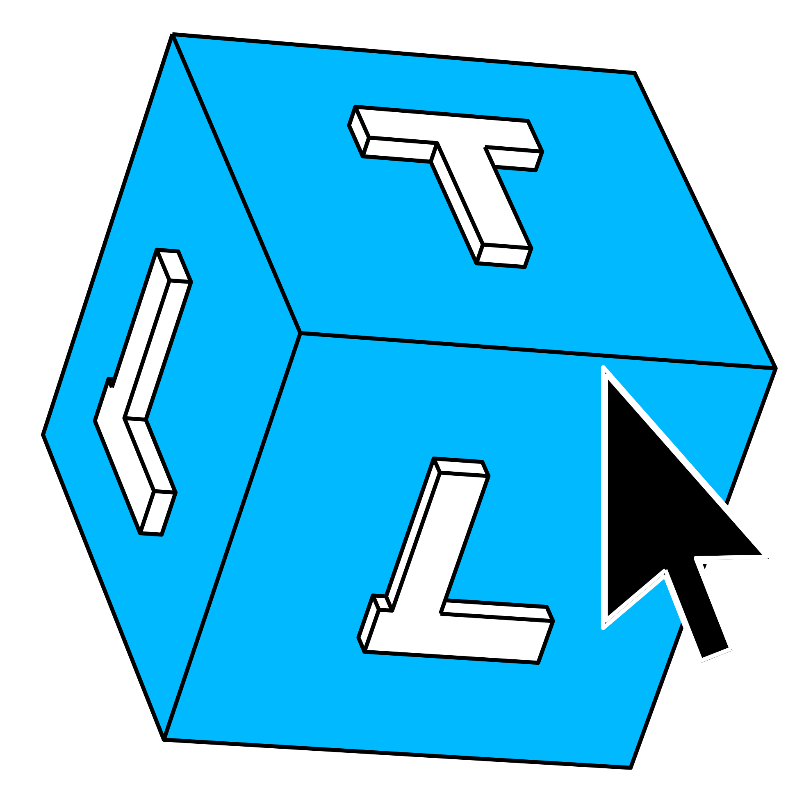

# Interactive Search Toolbox
The Interactive Search Toolbox is a JavaScript library for creating and running computer-based interactive search experiments. The toolbox works in tandem with the open-source JavaScript libraries [Three.js](https://threejs.org/), [jsPsych](https://www.jspsych.org/latest/), and [lodash](https://lodash.com/) to simplify creating virtual interactive search experiments capable of recording and storing large quantities of moment-to-moment interactive data packaged into standard experimental psychology frameworks. 


## Installation
Option 1 - Include library and css sheet via CDN.
```html
<head>
    <script src="https://cdn.jsdelivr.net/gh/InteractiveSearchToolbox/IST/build/IST.min.js"></script>
    <link href="https://cdn.jsdelivr.net/gh/InteractiveSearchToolbox/IST/build/IST.min.css" rel="stylesheet" type="text/css"/>
</head>
```

Option 2 - Download files to local directory and include these within your own project
- IST - [download here](https://cdn.jsdelivr.net/gh/InteractiveSearchToolbox/IST/build/IST.min.js)
- IST CSS - [download here](https://cdn.jsdelivr.net/gh/InteractiveSearchToolbox/IST/build/IST.min.css)

## Usage
Add the class into your project once at the top of your javascript file and initiate it using ```init()```.

The IST dynamically imports other libraries at run time. As such, you must wait for ```init()``` to complete.
There are two ways to do this. 
- Option 1: use the ```await``` keyword 
```js
// Option 1
const IST = new InteractiveSearchToolbox({enableAmbientLighting: true});
await IST.init();

// Rest of the experiment goes here...
```
- Option 2: Use the ```.then()``` syntax.
```js
// Option 2
const IST = new InteractiveSearchToolbox({enableAmbientLighting: true });   
IST.init().then(function(){
    // Rest of the experiment goes here...
});
```

- Note, if using option 1 inside of a function, then you will need to list that function as ```async```. 
## I want to use other three.js addons?
It is easy to add other three.js classes/addons that are not already included by default within the IST by using the ```threeAddons``` setting when adding the IST to your project. 

Simply include the name of the class/module you want to import and the path to that class/module in an array and pass that to the ```threeAddons``` setting.

For example, if you wanted to include an FBX loader and the post processing Bloom Pass effect...
```js
const IST = new InteractiveSearchToolbox({
    threeAddons:[
        ["FBXLoader","three/addons/loaders/FBXLoader.js"],
        ["BloomPass","three/addons/postprocessing/BloomPass.js"]
    ]
})    
await IST.init()
```

## I want to use other jsPsych Plugins
The IST comes with several jsPsych plugins included as default but if you need more you can simply add them via the ```jsPsychPlugins``` setting.

```js
const IST = new InteractiveSearchToolbox({
    jsPychPlugins: ["plugin-instructions","plugin-survey-multi-choice@2.2.1"]
})    
await IST.init()
```
To specify a particular version of any plugin, add ```@``` and the version number at the end of the plugin name. 
If no version number is provided, the latest version of the plugin will be used.

If a plugin is already included by default and you re-include it within this list, then the IST will not re-load this plugin unless you have specified a version different to what is already loaded.

## I want to use a different jsPsych/three.js version?
If you want to change which version of jsPsych or three.js the IST is using then you can do so via the ```jsPsychVersion``` and the ```threeJSVersion``` settings. 

```js
const IST = new InteractiveSearchToolbox({
    jsPsychVersion: "8.2.2",
    threeJSVersion: "0.170.0",
})    
await IST.init()
```

If no versions are supplied, the latest version available will be used.
Note that using older versions may produce unexpected errors/behaviours.

## Give me physcis!
If you want to add physics simulations to your project simply set the ```includePhysics``` setting to ```true```.

```js
const IST = new InteractiveSearchToolbox({
    includePhysics: true
})    
await IST.init()
```

Now the RapierJS physics engine is loaded and ready to use. All features can be accessed via the global ```RAPIER``` variable.

For instructions on how to use RapierJS, visit their documentation site [here](https://rapier.rs/docs/user_guides/javascript/rigid_bodies). 

## Guides
Basics and tutorials [here](https://hjgodwin.github.io/searchLab/istguide/).
